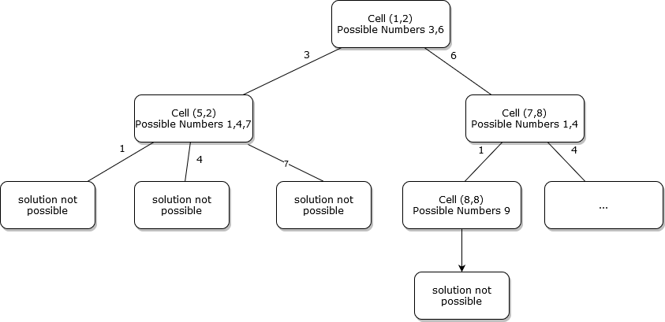

# SudokuSolver
This project is implementation of solver for classical sudoku. 

The solving uses depth-first search in the tree of possible numbers in all missing cells in the given sudoku. It starts with given assignments and finds possible numbers for all missing cells. Then it recursively tries to assign numbers to cells. Recursion could be problem sometimes but in the case of sudoku, the tree would not be so deep, so there is no danger of StackOverflowError.

The solution consists from two basic classes. **Solver** and **SolverState**. Class **SolverState** contains initial assignment and map of found numbers for cells. The reference of initial assignment is copied to new states because it is not mutated and it would be useless to copy it to each instance of **SolverState**.
Map of found numbers are copied because it is updated during processing of the state.
